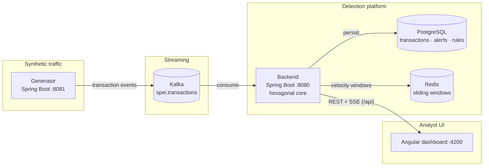
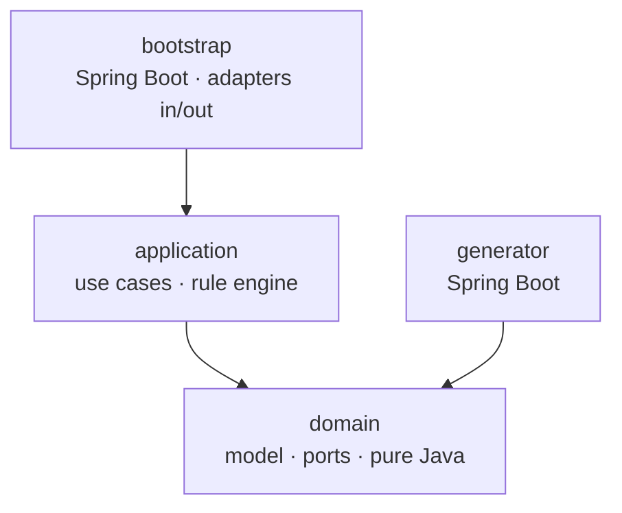

# Centinela — Architecture

> Living document. Expanded with sequence diagrams and metrics in phase 6.

## System context

## Backend module graph (hexagonal)

Dependencies point inward only; `domain` and `application` are framework-free by construction
(see [ADR-0001](adr/0001-hexagonal-multi-module.md)).
